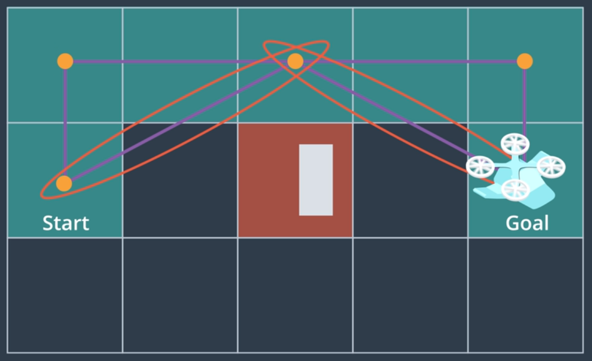
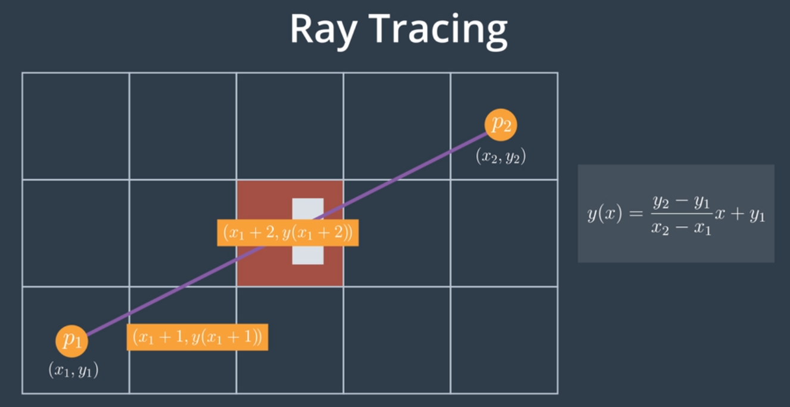
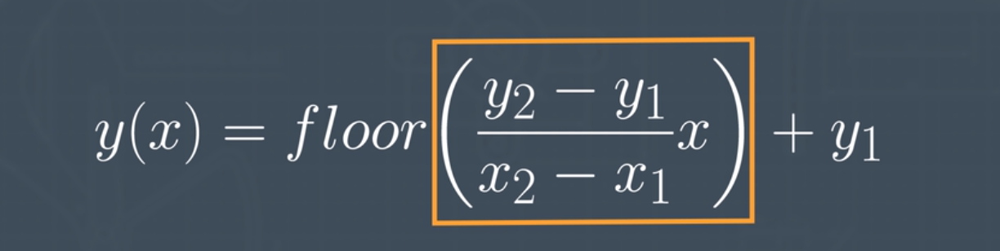
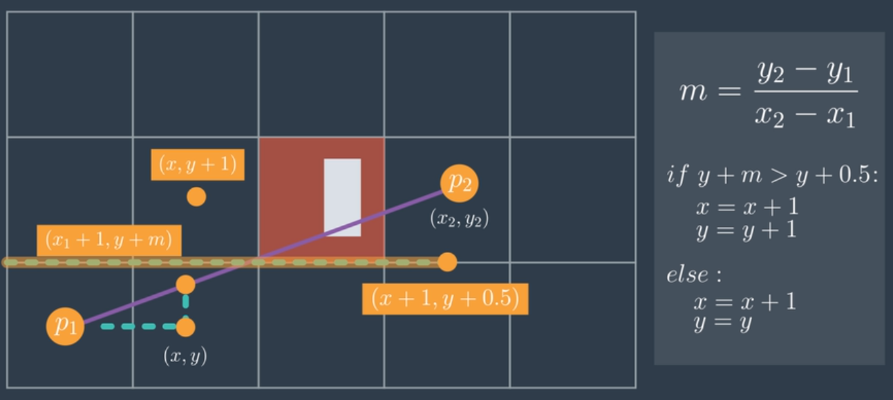

# AAE_Notebook_007_Bresenham
Now that we've begun pruning our path of waypoints, we take a deeper look at collinearity and why it may not be the most optimal of solutions.

The collinearity test helps us to identify which cells aren't precedent in reaching our goal; however, it doesn't, necessarily, lead to the optimal results.

Consider the following picture in which the previous, collinear example is given. Note the additional diagnals that further refine the path so far as overall distance traveled:

Looking at the above diagnals, we can use Ray Tracing to determine if any of the cells through which the ray crosses as an obstacle. If they do not, a more optimal path has been found.

However, when taking into consideration the hardware upon which our code shall run, ray tracing may not exactly be the answer either. As you can see (highlighted in the following picture), the computation of the ray tracing algorithm will lead to floating point numbers. Albeit, much of todays hardware have at least a limited precision FPU (floating point unit), it's still more computationally expensive to perform floating point operations than it is to perform integer math...

This leads us to the topic of our notebook, the Bresenham algorithm.

The key idea is that it will compute an increment for both X and Y as we iterate from X1 to X2. Thus, if we have points P1(X1,Y1) and P2(X2,Y2), we can iterate from X1 to X1+1, X1+2, etc, until we reach X2. Rather than calculating the value Y of X1+1, Y of X1+2, and so on, we'll store an increment for X and an increment for Y. We'll, then, store whether than increment is above or below the line for Y + 0.5.

